<h1 align="center">
    
</h1>

<h3 align="center">A graph database that supports more than 10 billion vertices & edges, high performance and scalability</h3>

<div align="center">

[](https://www.apache.org/licenses/LICENSE-2.0.html)
[](https://github.com/apache/incubator-hugegraph/actions/workflows/ci.yml)
[](https://github.com/apache/incubator-hugegraph/actions/workflows/licence-checker.yml)
[](https://github.com/apache/hugegraph/releases)
[](https://deepwiki.com/apache/hugegraph)

</div>

---

**Quick Navigation:** [Architecture](#architecture) • [Quick Start](#quick-start) • [Module Map](#module-map) • [Ecosystem](#ecosystem) • [For Contributors](#for-contributors) • [Community](#community)

---

## Table of Contents

- [What is Apache HugeGraph?](#what-is-apache-hugegraph)
- [Features](#features)
- [Architecture](#architecture)
- [Quick Start](#quick-start)
  - [TL;DR - 5 Minutes Quick Start](#tldr---5-minutes-quick-start)
  - [Prerequisites](#prerequisites)
  - [Option 1: Docker (Fastest)](#option-1-docker-fastest)
  - [Option 2: Download Binary Package](#option-2-download-binary-package)
  - [Option 3: Build from Source](#option-3-build-from-source)
  - [Verify Installation](#verify-installation)
- [Module Map](#module-map)
- [Ecosystem](#ecosystem)
- [For Contributors](#for-contributors)
- [Contributing](#contributing)
- [License](#license)
- [Community](#community)
- [Thanks](#thanks)

## What is Apache HugeGraph?

[HugeGraph](https://hugegraph.apache.org/) is a fast and highly-scalable [graph database](https://en.wikipedia.org/wiki/Graph_database).
Billions of vertices and edges can be easily stored into and queried from HugeGraph due to its excellent OLTP capabilities.
HugeGraph is compliant with the [Apache TinkerPop 3](https://tinkerpop.apache.org/) framework allowing complicated graph queries to be
achieved through the powerful [Gremlin](https://tinkerpop.apache.org/gremlin.html) graph traversal language.

## Features

- **Compliant to [Apache TinkerPop 3](https://tinkerpop.apache.org/)**: Supports [Gremlin](https://tinkerpop.apache.org/gremlin.html) & [Cypher](https://en.wikipedia.org/wiki/Cypher_(query_language)) query languages
- **Schema Metadata Management**: VertexLabel, EdgeLabel, PropertyKey, and IndexLabel
- **Multi-type Indexes**: Exact query, range query, and complex conditions combination query
- **Plug-in Backend Store Framework**: Mainly supports `RocksDB`/`HStore` + `HBase`; other backends available in [legacy versions](https://hugegraph.apache.org/docs/download/download/) ≤ `1.5.0` (MySQL/PostgreSQL/Cassandra...)
- **Big Data Integration**: Seamless integration with `Flink`/`Spark`/`HDFS`
- **Complete Graph Ecosystem**: In/out-memory Graph Computing + Graph Visualization & Tools + Graph Learning & AI

## Architecture

HugeGraph supports both **standalone** and **distributed** deployments:

```
                         ┌─────────────────────────────────────────────────────┐
                         │                   Client Layer                       │
                         │   Gremlin Console │ REST API │ Cypher │ SDK/Tools   │
                         └─────────────────────────┬───────────────────────────┘
                                                   │
                         ┌─────────────────────────▼───────────────────────────┐
                         │              HugeGraph Server (:8080)                │
                         │  ┌──────────┐  ┌──────────┐  ┌──────────────────┐   │
                         │  │ REST API │  │ Gremlin  │  │   Cypher Engine  │   │
                         │  │(Jersey 3)│  │ (TP 3.5) │  │   (OpenCypher)   │   │
                         │  └────┬─────┘  └────┬─────┘  └────────┬─────────┘   │
                         │       └─────────────┼─────────────────┘             │
                         │             ┌───────▼───────┐                       │
                         │             │  Graph Engine │                       │
                         │             │(hugegraph-core)│                      │
                         │             └───────┬───────┘                       │
                         └─────────────────────┼───────────────────────────────┘
                                               │
              ┌────────────────────────────────┼────────────────────────────────┐
              │                                │                                │
┌─────────────▼─────────────┐   ┌──────────────▼──────────────┐   ┌────────────▼────────────┐
│    Standalone Mode        │   │     Distributed Mode        │   │   Legacy Backends       │
│  ┌─────────────────────┐  │   │  ┌───────────────────────┐  │   │     (≤ v1.5.0)          │
│  │      RocksDB        │  │   │  │    HugeGraph-PD       │  │   │  MySQL │ PostgreSQL    │
│  │    (embedded)       │  │   │  │  (Raft, 3-5 nodes)    │  │   │  Cassandra │ HBase     │
│  └─────────────────────┘  │   │  │     :8620/:8686       │  │   │                         │
│                           │   │  └───────────┬───────────┘  │   └─────────────────────────┘
│  Use Case:                │   │              │              │
│  Development/Testing      │   │  ┌───────────▼───────────┐  │
│  Single Node              │   │  │   HugeGraph-Store     │  │
│                           │   │  │  (Raft + RocksDB)     │  │
│  Data Scale: < 100GB      │   │  │  (3+ nodes) :8520     │  │
└───────────────────────────┘   │  └───────────────────────┘  │
                                │                             │
                                │  Use Case:                  │
                                │  Production/HA/Cluster      │
                                │                             │
                                │  Data Scale: 100GB+         │
                                └─────────────────────────────┘
```

### Deployment Mode Comparison

| Mode | Components | Use Case | Data Scale | High Availability |
|------|------------|----------|------------|-------------------|
| **Standalone** | Server + RocksDB | Development, Testing, Single Node | < 100GB | No |
| **Distributed** | Server + PD (3-5 nodes) + Store (3+ nodes) | Production, HA, Horizontal Scaling | 100GB+ | Yes |

### Module Overview

| Module | Description |
|--------|-------------|
| [hugegraph-server](hugegraph-server) | Core graph engine with REST API, Gremlin/Cypher support, and pluggable backends (RocksDB default) |
| [hugegraph-pd](hugegraph-pd) | Placement Driver for distributed mode - handles meta storage, partition management and cluster scheduling |
| [hugegraph-store](hugegraph-store) | Distributed storage with Raft consensus for high availability and horizontal scaling |
| [hugegraph-commons](hugegraph-commons) | Shared utilities, RPC framework and common components |

```mermaid
flowchart TB
    subgraph Clients["Client Layer"]
        GC[Gremlin Console]
        REST[REST Client]
        CYPHER[Cypher Client]
        SDK[SDK/Tools]
    end

    subgraph Server["HugeGraph Server :8080"]
        API[REST API<br/>Jersey 3]
        GS[Gremlin Server<br/>TinkerPop 3.5]
        CS[Cypher Engine<br/>OpenCypher]
        CORE[Graph Engine<br/>hugegraph-core]

        API --> CORE
        GS --> CORE
        CS --> CORE
    end

    subgraph Storage["Storage Layer"]
        subgraph Standalone["Standalone Mode"]
            ROCKS[(RocksDB<br/>Embedded)]
        end

        subgraph Distributed["Distributed Mode"]
            PD[HugeGraph-PD<br/>Raft Cluster<br/>:8620/:8686]
            STORE[HugeGraph-Store<br/>Raft + RocksDB<br/>:8520]
            PD <--> STORE
        end

        subgraph Legacy["Legacy Backends ≤v1.5.0"]
            MYSQL[(MySQL)]
            PG[(PostgreSQL)]
            CASS[(Cassandra)]
            HBASE[(HBase)]
        end
    end

    Clients --> Server
    CORE --> ROCKS
    CORE --> PD
    CORE -.-> Legacy

    style Server fill:#e1f5ff
    style Distributed fill:#fff4e1
    style Standalone fill:#f0f0f0
```

<details>
<summary><b>📊 Click to view detailed architecture diagram (Mermaid)</b></summary>



</details>

## Quick Start

### TL;DR - 5 Minutes Quick Start

```bash
# Start HugeGraph with Docker
docker run -itd --name=hugegraph -p 8080:8080 hugegraph/hugegraph:1.7.0

# Verify server is running
curl http://localhost:8080/apis/version

# Try a Gremlin query
curl -X POST http://localhost:8080/gremlin \
  -H "Content-Type: application/json" \
  -d '{"gremlin":"g.V().limit(5)"}'
```

> **Production Note**: For production environments or public network exposure, you **must** enable the [AuthSystem](https://hugegraph.apache.org/docs/config/config-authentication/) for security.

### Prerequisites

- **Java 11+** (required)
- **Maven 3.5+** (for building from source)

Verify your environment:
```bash
java -version   # Should show Java 11 or higher
mvn -version    # Should show Maven 3.5+
```

### Option 1: Docker (Fastest)

Docker is the quickest way to get started for **testing or development**:

```bash
# Basic usage
docker run -itd --name=hugegraph -p 8080:8080 hugegraph/hugegraph:1.7.0

# With sample graph preloaded
docker run -itd --name=hugegraph -e PRELOAD=true -p 8080:8080 hugegraph/hugegraph:1.7.0

# With authentication enabled
docker run -itd --name=hugegraph -e PASSWORD=your_password -p 8080:8080 hugegraph/hugegraph:1.7.0
```

For advanced Docker configurations, see:
- [Docker Documentation](https://hugegraph.apache.org/docs/quickstart/hugegraph-server/#3-deploy)
- [Docker Compose Example](./hugegraph-server/hugegraph-dist/docker/example)
- [Docker README](hugegraph-server/hugegraph-dist/docker/README.md)

> **Note**: Docker images are convenience releases, not **official ASF distribution artifacts**. See [ASF Release Distribution Policy](https://infra.apache.org/release-distribution.html#dockerhub) for details.
>
> **Version Tags**: Use release tags (`1.7.0`, `1.x.0`) for stable versions. Use `latest` for development features.

### Option 2: Download Binary Package

Download pre-built packages from the [Download Page](https://hugegraph.apache.org/docs/download/download/):

```bash
# Download and extract
wget https://downloads.apache.org/incubator/hugegraph/{version}/apache-hugegraph-incubating-{version}.tar.gz
tar -xzf apache-hugegraph-incubating-{version}.tar.gz
cd apache-hugegraph-incubating-{version}

# Initialize backend storage
bin/init-store.sh

# Start server
bin/start-hugegraph.sh

# Check server status
bin/monitor-hugegraph.sh
```

For detailed instructions, see the [Binary Installation Guide](https://hugegraph.apache.org/docs/quickstart/hugegraph-server/#32-download-the-binary-tar-tarball).

### Option 3: Build from Source

Build from source for development or customization:

```bash
# Clone repository
git clone https://github.com/apache/hugegraph.git
cd hugegraph

# Build all modules (skip tests for faster build)
mvn clean package -DskipTests

# Extract built package
cd install-dist/target
tar -xzf hugegraph-{version}.tar.gz
cd hugegraph-{version}

# Initialize and start
bin/init-store.sh
bin/start-hugegraph.sh
```

For detailed build instructions, see [BUILDING.md](BUILDING.md) and [Build from Source Guide](https://hugegraph.apache.org/docs/quickstart/hugegraph-server/#33-source-code-compilation).

### Verify Installation

Once the server is running, verify the installation:

```bash
# Check server version
curl http://localhost:8080/apis/version

# Expected output:
# {
#   "version": "1.7.0",
#   "core": "1.7.0",
#   "gremlin": "3.5.1",
#   "api": "1.7.0"
# }

# Try Gremlin console (if installed locally)
bin/gremlin-console.sh

# In Gremlin console:
gremlin> :remote connect tinkerpop.server conf/remote.yaml
gremlin> :> g.V().limit(5)
```

For comprehensive documentation, visit the [HugeGraph Documentation](https://hugegraph.apache.org/docs/).

## Module Map

**Developer Navigation**: Find the right module for your task

| I want to... | Module | Key Path |
|--------------|--------|----------|
| Understand graph operations | `hugegraph-core` | `StandardHugeGraph.java` |
| Modify REST APIs | `hugegraph-api` | `src/.../api/` |
| Add storage backend | `hugegraph-core` | `BackendStore.java` |
| Develop Gremlin features | `hugegraph-core` | `src/.../traversal/` |
| Develop Cypher features | `hugegraph-api` | `src/.../opencypher/` |
| Work on distributed coordination | `hugegraph-pd` | `hg-pd-core/` |
| Work on distributed storage | `hugegraph-store` | `hg-store-core/` |
| Add backend implementations | `hugegraph-server/hugegraph-{backend}` | `hugegraph-rocksdb/`, `hugegraph-hstore/` |
| Understand configuration | `hugegraph-dist` | `src/assembly/static/conf/` |
| Run tests | `hugegraph-test` | Test suites with multiple profiles |

For detailed architecture and development guidance, see [AGENTS.md](AGENTS.md).

## Ecosystem

Complete **HugeGraph** ecosystem components:

1. **[hugegraph-toolchain](https://github.com/apache/hugegraph-toolchain)** - Graph tools suite
   - [Loader](https://github.com/apache/hugegraph-toolchain/tree/master/hugegraph-loader) - Data import tool
   - [Dashboard](https://github.com/apache/hugegraph-toolchain/tree/master/hugegraph-hubble) - Web visualization platform
   - [Tool](https://github.com/apache/hugegraph-toolchain/tree/master/hugegraph-tools) - Command-line utilities
   - [Client](https://github.com/apache/hugegraph-toolchain/tree/master/hugegraph-client) - Java/Python client SDK

2. **[hugegraph-computer](https://github.com/apache/hugegraph-computer)** - Integrated **graph computing** system

3. **[hugegraph-ai](https://github.com/apache/incubator-hugegraph-ai)** - **Graph AI/LLM/Knowledge Graph** integration

4. **[hugegraph-website](https://github.com/apache/hugegraph-doc)** - **Documentation & website** repository

## For Contributors

**New to HugeGraph?** Follow this path to get started:

1. **📖 Understand the Architecture**
   - Read [AGENTS.md](AGENTS.md) for detailed module structure and development patterns
   - Review the [Architecture Diagram](#architecture) above

2. **🛠️ Set Up Your Environment**
   - Install Java 11+ and Maven 3.5+
   - Follow [BUILDING.md](BUILDING.md) for build instructions
   - Import `hugegraph-style.xml` into your IDE for code style

3. **🔍 Find Your First Issue**
   - Browse [Good First Issues](https://github.com/apache/hugegraph/issues?q=label%3A%22good+first+issue%22)
   - Check [Help Wanted Issues](https://github.com/apache/hugegraph/issues?q=label%3A%22help+wanted%22)

4. **💡 Learn the Codebase**
   - Use the [Module Map](#module-map) to navigate
   - Run tests to understand behavior: `mvn test -pl hugegraph-server/hugegraph-test -am -P core-test,memory`
   - Try modifying a test and see what breaks

5. **✅ Code Standards**
   - Line length: 100 characters
   - Indentation: 4 spaces
   - No star imports
   - Commit format: `feat|fix|refactor(module): description`

6. **🚀 Submit Your Contribution**
   - Read [CONTRIBUTING.md](CONTRIBUTING.md) for guidelines
   - Follow the [Contribution Guidelines](https://hugegraph.apache.org/docs/contribution-guidelines/)
   - Use [GitHub Desktop](https://desktop.github.com/) to simplify the PR process

## Contributing

Welcome to contribute to HugeGraph!

- **How to Contribute**: See [CONTRIBUTING.md](CONTRIBUTING.md) and [Contribution Guidelines](https://hugegraph.apache.org/docs/contribution-guidelines/)
- **Code Style**: Import `hugegraph-style.xml` into your IDE
- **PR Tool**: [GitHub Desktop](https://desktop.github.com/) is recommended for simpler workflow

Thank you to all the contributors who have helped make HugeGraph better!

[](https://github.com/apache/incubator-hugegraph/graphs/contributors)

## License

HugeGraph is licensed under [Apache 2.0 License](LICENSE).

## Community

**Get Help & Stay Connected**

- **[GitHub Issues](https://github.com/apache/hugegraph/issues)**: Report bugs and request features (quick response)
- **Mailing List**: [dev@hugegraph.apache.org](mailto:dev@hugegraph.apache.org) ([subscribe here](https://hugegraph.apache.org/docs/contribution-guidelines/subscribe/))
- **Slack**: [ASF HugeGraph Channel](https://the-asf.slack.com/archives/C059UU2FJ23)
- **WeChat**: Scan the QR code to follow Apache HugeGraph official account

<p align="center">

</p>

## Thanks

HugeGraph relies on the [Apache TinkerPop](http://tinkerpop.apache.org) framework. We are grateful to the TinkerPop community, Titan, and DataStax for their foundational work. Thanks to all contributors and organizations who have helped make HugeGraph possible.

You are welcome to contribute to HugeGraph, and we look forward to working with you to build an excellent open-source community.
