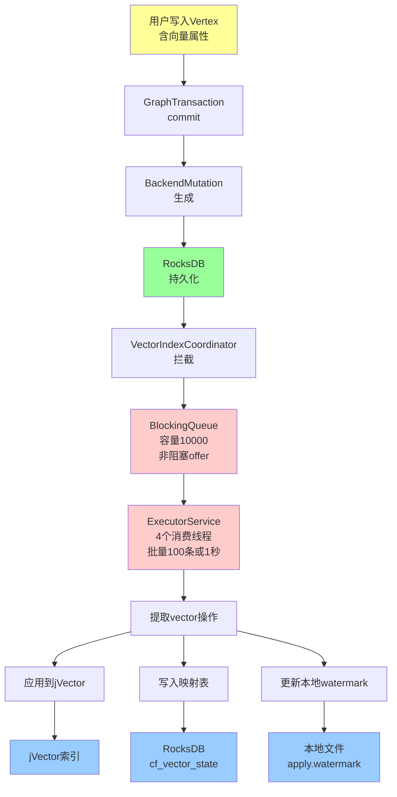
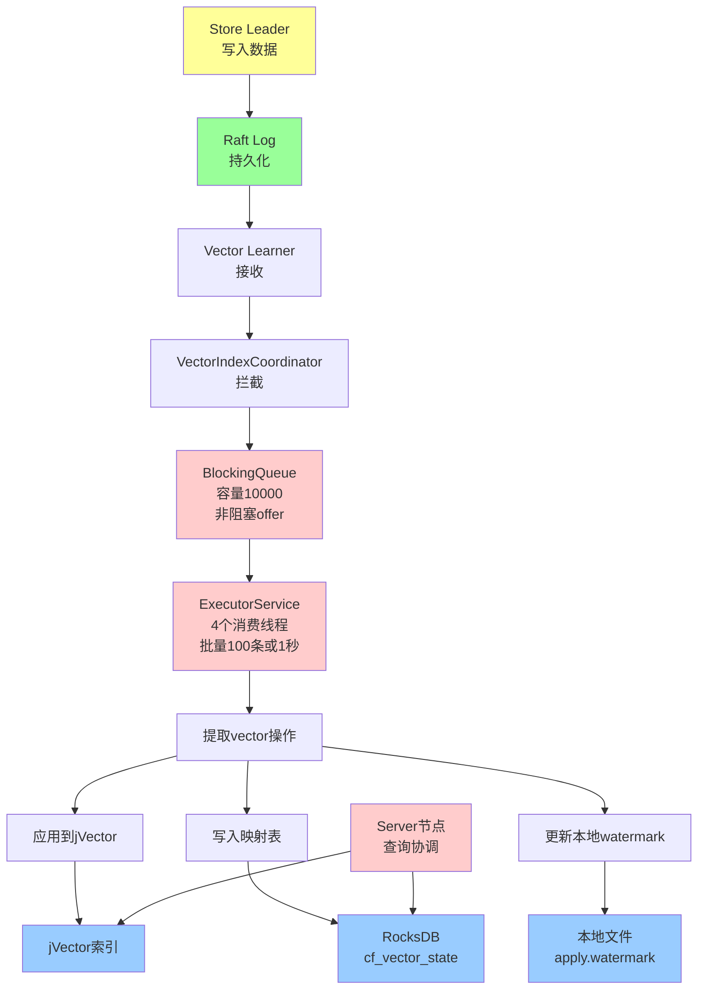
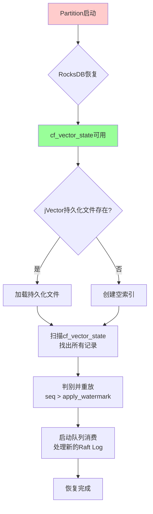
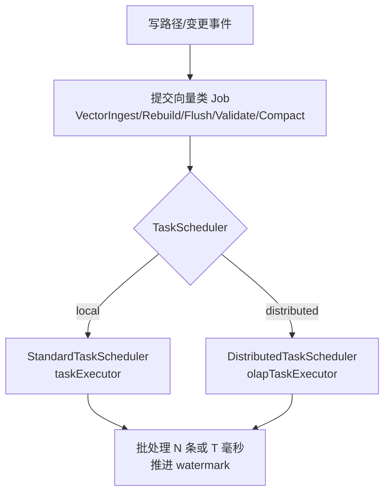
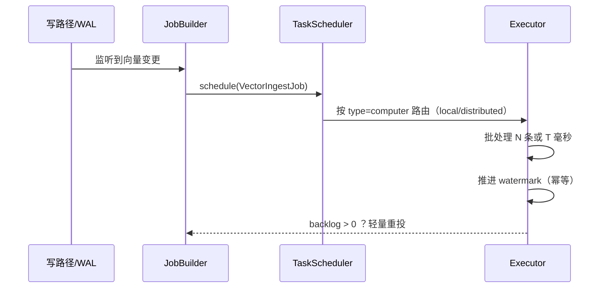
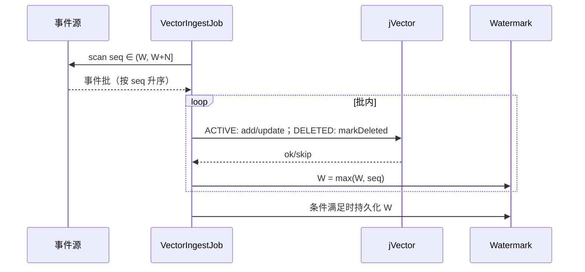
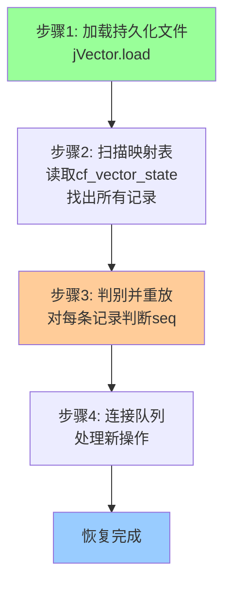
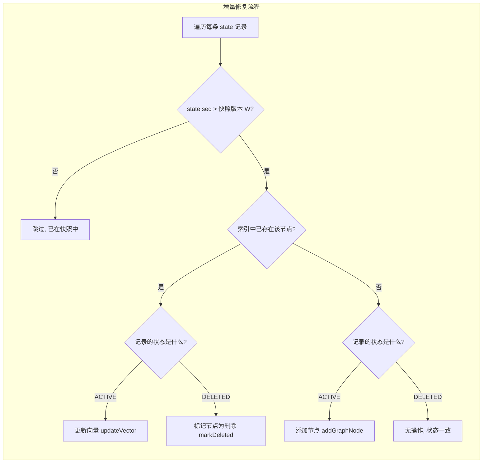
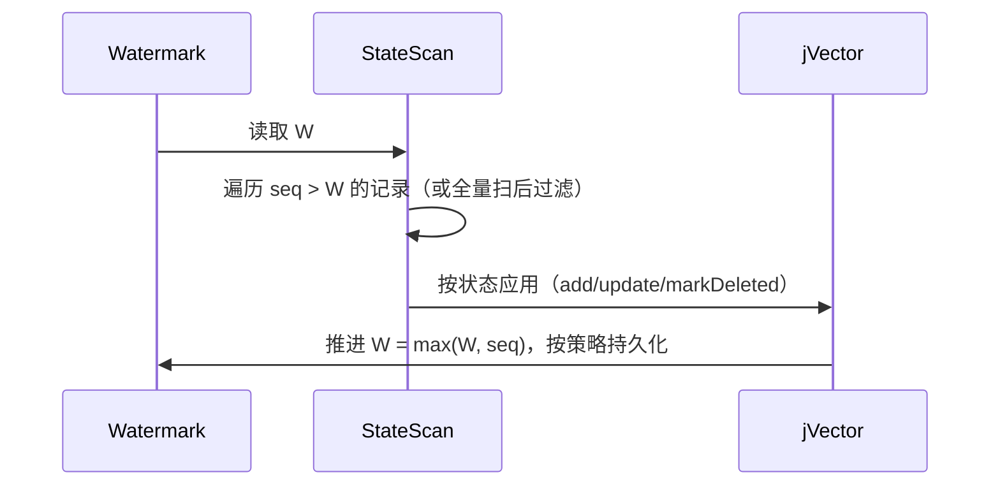

# HugeGraph 向量索引设计文档

## 1. 概述

### 1.1 设计目标

在HugeGraph中实现向量索引功能，通过异步消费BackendMutation，构建jVector向量索引，支持高性能向量搜索。

### 1.2 核心特性

- **异步处理**：使用BlockingQueue + ExecutorService，不阻塞主流程
- **三层恢复**：jVector持久化文件 + cf_vector_state + WAL/Raft Log，秒级恢复
- **增量更新**：利用jVector增量能力，避免全量重建
- **最终一致性**：支持单点和分布式部署

### 1.3 核心流程

```text
写入 → RocksDB持久化 → 拦截器 → 队列(非阻塞) → 消费线程(批量) → jVector + cf_vector_state
```

## 2. 架构设计

### 2.1 单点模式



**特点**：

- 简单部署，无需分布式协调
- 队列异步处理，不阻塞主流程
- 批量消费，提高吞吐量
- 轻量级WAL用于恢复
- 本地搜索

### 2.2 分布式模式



**特点**：

- 高可用性，故障自动切换
- 角色分离，故障隔离
- 队列异步处理，批量消费
- 基于Raft Log的异步同步
- 最终一致性

### 2.3 分布式恢复机制

**关键前提**：

1. **Partition 隔离**：每个 partition 有独立的 Raft Group 和 RocksDB 实例
2. **Raft Index 作用域**：每个 partition 的 raftIndex 独立递增（从1开始）
3. **RocksDB 可靠性**：由 Raft 保证，crash 后数据不丢失
4. **cf_vector_state 可靠性**：存储在 RocksDB 中，随 RocksDB 一起恢复

**恢复流程（每个 partition 独立执行）**：



**关键保证**：

1. **Partition 独立性**：

   - 每个 partition 独立恢复，互不影响
   - Partition A crash 不影响 Partition B
2. **Raft Index 隔离**：

   - 每个 partition 的 raftIndex 独立递增
   - cf_vector_state 的 sequence_number 就是 partition 内的 raftIndex
3. **数据一致性**：

   - RocksDB 由 Raft 保证一致性
   - cf_vector_state 随 RocksDB 一起恢复
   - jVector 从 cf_vector_state 重建，保证最终一致
4. **Learner 角色恢复**：

   - Learner crash 后，RocksDB 数据完整（Raft 同步）
   - jVector 索引可能不完整（异步构建）
   - 从 cf_vector_state 重建 jVector 即可

**潜在问题与解决**：


| 问题                    | 场景                                   | 解决方案                                 |
| ----------------------- | -------------------------------------- | ---------------------------------------- |
| Raft Log 压缩           | cf_vector_state 损坏且 Raft Log 已压缩 | cf_vector_state 随 RocksDB Snapshot 备份 |
| 多 Partition 同时 crash | 集群故障                               | 每个 partition 独立恢复，并发执行        |
| Learner 长时间离线      | Raft Log 已压缩                        | 从 Leader 的 RocksDB Snapshot 恢复       |

## 3. 核心组件

### 3.1 cf_vector_state映射表

**三重角色**：

1. **ID映射**：vector_id (jVector ordinal) → vertex_id
2. **状态记录**：记录每个向量的状态和sequence_number
3. **恢复基础**：高精度恢复点

**存储结构**：

存储结构（cf_vector_state）：


| 项目            | 说明                                                 |
| --------------- | ---------------------------------------------------- |
| CF              | cf_vector_state                                      |
| Key             | vector_id（jVector ordinal, int）                    |
| Value.vertex_id | 顶点唯一标识（vertex_id）                            |
| Value.seq       | sequence_number（单机: RocksSeq；分布式: RaftIndex） |
| Value.status    | ACTIVE / DELETED                                     |
| Value.timestamp | 写入/更新时间戳                                      |

示例（文字化）：

- 新增：写入 → BackendMutation(seq=100) → `addGraphNode(ordinal=5)` → cf_vector_state[5] = {vertex_id=v1, seq=100, status=ACTIVE, ...}
- 更新：写入 → BackendMutation(seq=200) → `updateVector(ordinal=5)` → cf_vector_state[5] = {vertex_id=v1, seq=200, status=ACTIVE, ...}

1. **删除时标记版本**：

- 删除：写入 → BackendMutation(seq=300) → `markNodeDeleted(ordinal=5)` → cf_vector_state[5] = {vertex_id=v1, seq=300, status=DELETED, ...}

**版本号作用** ：

- 确定哪些操作已应用到jVector
- 恢复时计算增量范围（Delta）
- 避免重复应用相同操作

## 4. 线程与任务调度（与现有 Task 调度方案结合）

### 4.1 总览图



### 4.2 任务类型与路由表


| Job 类型          | 职责                          | type()     | 路由执行器（local / distributed） | 批处理粒度                          |
| ----------------- | ----------------------------- | ---------- | --------------------------------- | ----------------------------------- |
| VectorIngestJob   | 增量摄取/追赶，推进 watermark | "computer" | taskExecutor / olapTaskExecutor   | N 条或 T 毫秒                       |
| VectorRebuildJob  | 全量重建、切换映射            | "computer" | taskExecutor / olapTaskExecutor   | 分阶段（SCAN/BUILD/CLEANUP/SWITCH） |
| VectorFlushJob    | 触发 jVector 持久化           | "computer" | taskExecutor / olapTaskExecutor   | 小批、快速                          |
| VectorValidateJob | 一致性校验、报告              | "computer" | taskExecutor / olapTaskExecutor   | 取样/分片                           |
| VectorCompactJob  | 删除收敛/图修剪               | "computer" | taskExecutor / olapTaskExecutor   | 受限时长                            |

### 4.3 提交流程与去重

1. 触发：写路径/WAL 监听到向量变更，尝试提交对应 Job（按 index/partition 粒度）
2. 去重：查询 Task 表，若已存在同键（graph,indexId,partitionId,jobType）且状态 ∈ {NEW, QUEUED, RUNNING}，则跳过提交
3. 执行：单次处理固定上限【N 条或 T 毫秒】，期间推进 watermark；批内失败记录并跳过（幂等保障）
4. 续作：若 backlog 仍大，则在任务尾部轻量重投下一次 Ingest；或等待下一次写路径触发
5. 观测：`backlog.gauge = last_committed_seq - watermark`，用于背压与告警

### 4.4 队列与调度整合

- 不新增“向量专用线程池/消费队列”，统一通过 HugeTask 调度承担异步处理
- 分布式：`type() = computer` 的 Job 自动路由到 `olapTaskExecutor`，线程忙则保持 NEW（天然背压）
- 本地：所有 Job 走 `taskExecutor`，通过“批大小/时间片”限制单次占用时长
- 可选：如需短暂缓冲，仅作为“触发信号”，实际处理仍落在 Job 中

### 4.5 参数与背压


| 参数                        | 默认      | 说明                       |
| --------------------------- | --------- | -------------------------- |
| vector.ingest.batch_size    | 100~1000  | 每次处理的记录数上限       |
| vector.ingest.time_slice_ms | 100~500ms | 单次任务的时间片上限       |
| vector.cleanup.enable       | true      | 是否在合适窗口触发 cleanup |

背压行为：

- 分布式：执行器线程不空闲时，NEW 任务不启动，等待下一轮（无需额外限流）
- 本地：通过批大小/时间片控制任务占用，避免长时间独占

### 4.6 指标与观测


| 指标                                                    | 含义                                       |
| ------------------------------------------------------- | ------------------------------------------ |
| hugegraph.vector.job.submitted/success/failed/cancelled | 任务生命周期统计                           |
| hugegraph.vector.job.exec.timer                         | 执行耗时分布                               |
| hugegraph.vector.backlog.gauge                          | 积压评估（last_committed_seq - watermark） |
| 任务命名包含 indexId/partitionId                        | 便于排查定位                               |

### 4.7 代码流程概览（示意）



### 4.8 事件源（队列）与读取

- 术语约定：本文中的“队列”不限定为内存 BlockingQueue。为了具备可恢复与确定性，推荐以“可持久读取的事件源”承担队列角色。
- 调度边界：不修改调度器与执行器，只定义向量类 Job 的读取来源与批处理方式。


| 事件源（队列）              | 耐久性 | 顺序保证（分区内） | 读取方式                      | 推荐度     | 说明                                              |
| --------------------------- | ------ | ------------------ | ----------------------------- | ---------- | ------------------------------------------------- |
| cf_vector_seq_index（建议） | 持久化 | 严格递增（按 seq） | scanRange(W+1, W+N)           | ★★★★☆ | 与 cf_vector_state 同批原子写入，天然“队列”     |
| cf_vector_state（兜底）     | 持久化 | 无全序（需过滤）   | 全量遍历后按 seq > W 过滤     | ★★☆☆☆ | 无二级索引时的兼容方案，需时间片/游标控制         |
| Raft Log（仅特定场景）      | 持久化 | 严格递增           | 读取 partition Raft 日志      | ★★☆☆☆ | 分布式场景可行，但实现与权限更重，优先用 seq 索引 |
| recent_event_buffer（可选） | 内存   | 近似时间顺序       | 批量poll/peek（不依赖正确性） | ★☆☆☆☆ | 仅作触发/加速信号；正确性仍依赖持久事件源         |

说明：W 为 watermark（本地“已应用上界”）。若存在 cf_vector_seq_index，则它就是“队列”。

### 4.9 消费与向量构建（批处理流程）

- 起点：S = W（当前 watermark）
- 读取：从首选事件源按 seq 升序读取，至多 N 条或 T 毫秒（二者其一到达即止）
- 应用：
  - ACTIVE：获取向量值（从顶点属性或缓存），判断 ordinal 是否存在 → addGraphNode 或 updateVector
  - DELETED：若存在则 markNodeDeleted
- 推进：批内周期性地推进 W = max(W, seq)，并按策略持久化（原子重命名，必要时 fsync）
- 续作：若 backlog > 0，则依赖调度器空闲时再启动下一批（无需常驻线程）



实施注意：

- 每个 graph/indexId/partitionId 至多允许一个 IngestJob RUNNING，避免并发写 jVector（提交前去重 + 运行时轻锁）
- 读放大控制：无二级索引时，记录“上次扫描游标”并限定时间片，逐批推进，避免每次全表扫
- 取数路径：向量值可来自 Vertex 属性或增量缓存；优先使用一致性读（由存储层保证提交后可见）

### 4.10 与任务分配的关系（澄清）

- 本方案不改变 HugeGraph 的任务分配策略：
  - local：仍在 taskExecutor 上执行；靠批大小/时间片防止长占用
  - distributed：向量类 Job 标记 type()="computer"，自动路由至 olapTaskExecutor（仅此类 Job 如此，其他 Job 类型不变）
- 背压保持：当执行器线程忙时，NEW 任务不启动；IngestJob 不需要常驻消费线程，由调度器在空闲时分批推进

### 4.11 队列与恢复的衔接

- 启动/恢复完成后，即以 4.9 的批处理方式从事件源“继续消费”直至追平 last_committed_seq
- 三种常见状态：
  - 冷启动：W=0 → 通过事件源快速补齐
  - 热重启：W≈last_committed_seq → 少量补差
  - 全量重建后切换：RebuildJob 完成后，IngestJob 从新映射/新 W 继续增量

## 5. 恢复机制

### 5.1 三层组件


| 层级 | 组件              | 作用         | 更新频率           | 恢复时间 |
| ---- | ----------------- | ------------ | ------------------ | -------- |
| 1    | jVector持久化文件 | 快速恢复点   | 每10000操作或5分钟 | 秒级     |
| 2    | cf_vector_state   | 高精度恢复点 | 每个操作后         | 毫秒级   |
| 3    | WAL/Raft Log      | 实时增量源   | 实时               | 毫秒级   |

### 5.2 恢复四步骤（利用 sequence_number 判别）

**核心原理**：jVector 没有版本概念，通过 cf_vector_state 的 sequence_number 来判别哪些操作需要重放



#### 详细步骤

#### 步骤1：加载持久化文件

- 若存在持久化文件：加载 jVector 索引文件
- 读取本地 apply_watermark（默认 0）
- 后续所有判断均以该水位作为“已应用上界”

#### 步骤2：扫描映射表

- 扫描 cf_vector_state 全表，收集 ordinal→state 映射（或按 seq 二级索引顺序扫描）
- state = {vertex_id, seq, status, timestamp}
- 如存在 cf_vector_seq_index，可直接按 seq 从小到大遍历，减少随机访问

#### 步骤3：判别并重放（关键逻辑）



#### 步骤4：进入增量任务路径

- 恢复完成后，转入第 4 章所述的 VectorIngestJob 正常增量处理路径（不依赖常驻消费线程/队列）

#### 关键判别点

1. **seq 判别**：`state.seq > apply_watermark` → 需要重放
2. **status 判别**：
   - `ACTIVE` → 需要添加或更新向量
   - `DELETED` → 需要删除向量
3. **新增 vs 更新判别**（针对 ACTIVE）：
   - `index.containsNode(ordinal)` 返回 true → 更新操作
   - `index.containsNode(ordinal)` 返回 false → 新增操作

**为什么需要判别新增 vs 更新？**

- jVector 的 `addGraphNode()` 和 `updateVector()` 是不同的 API
- 如果对已存在的 ordinal 调用 `addGraphNode()`，可能会报错或行为未定义
- 通过 `containsNode()` 检查可以确保调用正确的 API

**总恢复时间**：秒级（vs 全量重建：分钟~小时级）

### 5.3 本地 Watermark（必选）

- 定义：last_applied_seq，表示“本节点上该 partition+index 已应用到 jVector 的最新序号”
- 存放位置：节点本地 sidecar 文件，建议与索引文件同目录，例如：
  - data/vector_index/{partition}/{index_id}/apply.watermark
- 格式与容错：
  - 文本或 8 字节整型均可（示例用文本，内容为十进制 long）
  - 不存在或解析失败则视为 0（从头补齐，幂等）
- 读取流程（启动时）：
  - 如果文件存在 → 读取为 W；不存在 → W=0
- 写入与落盘策略（运行中）：
  - 每处理一批（N 条或 T 毫秒）推进一次到当前批最大 seq
  - 使用“临时文件 + 原子重命名（atomic rename）”写法，必要时调用 fsync 确保落盘
  - 单 writer 线程推进，避免并发竞态
- 宕机/丢失语义：
  - 最多回退到上一次写入的 W，导致多做幂等重放；不会影响正确性

实现要点（不写代码）：

- 路径：data/vector_index/{partition}/{index_id}/apply.watermark
- 读取：若文件存在读取为 long，否则视为 0（兜底）
- 写入：临时文件 + 原子重命名（atomic move），必要时 fsync 保证落盘
- 并发：单 writer 推进，避免竞态

恢复时的使用：



### 5.4 可选优化：按 seq 的二级索引与提交水位

- cf_vector_seq_index（推荐）：

  - 结构：CF key = seq（long，按序）→ value = {index_id, ordinal, status}
  - 写入路径：与 cf_vector_state 同一 batch 原子写入，保证确定性
  - 恢复路径：从 W+1 开始顺序扫描至末尾，显著减少无效遍历
- 写入路径：与 cf_vector_state 同批次原子写入 cf_vector_seq_index（key=seq，value={index_id, ordinal, status}）
- 恢复扫描：从 W+1 开始顺序扫描 seq 索引，应用到 jVector，推进并周期性持久化 W
- last_committed_seq（可选）：

  - 定义：该 partition/index 已提交的最新 seq 上界
  - 获取：可从 cf_vector_seq_index 的最大 key 推导，或另设 cf_vector_meta.last_committed_seq O(1) 读取
  - 作用：用于评估“落后差值”和进度观测；不参与正确性判定

### 5.5 兜底策略

- ✅ 持久化文件完整 → 快速加载 + 增量修复（秒级）
- ✅ 持久化文件损坏 → 从cf_vector_state重建（分钟级）
- ✅ cf_vector_state损坏 → 从WAL/Raft Log重放（分钟级）
- ✅ 全部损坏 → 从零构建（小时级，但数据不丢失）

## 6. 剩余任务与安排


| 任务项                              | 范围/说明                                                       | 优先级 | Owner | 里程碑 |
| ----------------------------------- | --------------------------------------------------------------- | ------ | ----- | ------ |
| VectorIngestJob 提交流程与去重      | 按 index/partition 去重；批处理 N 条或 T 毫秒；推进 watermark   | P0     | TBD   | M1     |
| Rebuild/Flush/Validate/Compact Jobs | 定义参数、权限与幂等；长任务分阶段（SCAN/BUILD/CLEANUP/SWITCH） | P1     | TBD   | M2     |
| cf_vector_state 存储与 API          | 建表、读写、扫描、求最大 seq；可选二级索引 cf_vector_seq_index  | P0     | TBD   | M1     |
| Watermark 持久化                    | 本地水位读写（apply_watermark）；写入原子性与崩溃恢复           | P0     | TBD   | M1     |
| 检索回译链路                        | search 结果 ordinal→vertex_id 回译返回 {vertex_id, score}      | P0     | TBD   | M1     |
| 持久化文件管理                      | 定期落盘、加载校验、异常兜底；文件格式与校验信息                | P1     | TBD   | M2     |
| 恢复流程                            | 加载文件→增量修复→处理新操作；分布式分区独立恢复              | P0     | TBD   | M2     |
| 指标与告警                          | 任务级统计、backlog 指标、失败重试与告警                        | P0     | TBD   | M1     |
| 配置与参数                          | 批大小、时间片、cleanup 开关；不新增线程池配置                  | P0     | TBD   | M1     |

## 7. 后续优化步骤

- 索引副本选择策略

  - 为每个 partition 配置 index_replicas = 1~2（如 Leader + 1 热备）；减少重复 CPU 开销
  - 查询路由到“索引副本”，故障时由热备接管
- 持久化文件优化

  - 增量落盘、并行加载、文件格式压缩；携带稀疏校验信息（校验/定位损坏）
- 恢复加速

  - 先加载持久化文件再并行扫描 cf_vector_state；按 partition/范围分片重放

<!-- 原第11章内容已合并进第4章（线程与任务调度）。本节移除以避免重复。 -->
